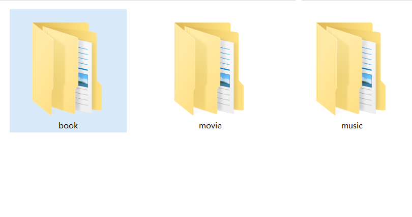
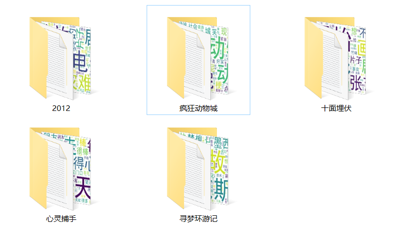
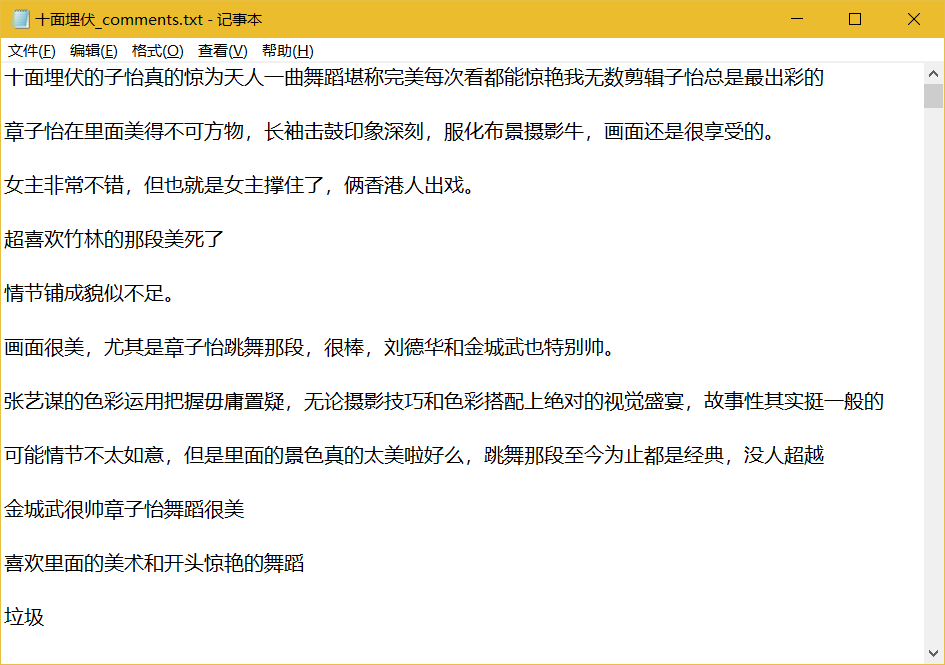

### GetID_Douban.py
Get a Douban id according to the film name,music name,or book name that you provid.

#### Douban_id():
在main函数中调用，需要自己创造对象，并将参数传进来。
##### def __init__(self,name,sort='movie'):
param name：电影名，音乐名或书本名。
param sort：分类，电影(movie)，图书(book)，音乐(music)。

##### def getID(self):
需要通过对象手动调用。
根据用户提供的名字和分类查找，拿到对应的id并返回值。

主要用xml和正则表达式。

### getComments.py
将Douban_id()获取的id和suburl拼凑出完整的短评url，拿到数据并保存在本地。返回值为文件保存的路径。

### Keywords.py
将保存在文件中的评论信息，进行清洗。清洗出的关键词生成词云。用到文件夹下的ChineseStopWords.txt，将所有的中文虚词剔除，可以自己做或者从网上下载。simhei.ttf词云字体类型。

### comments_infor
评论信息及词云存放位置。
#### screenshorts
数据存放
##### 分类目录:

##### 影片，电影，图书:

##### 评论保存文件：

##### 词云显示:

